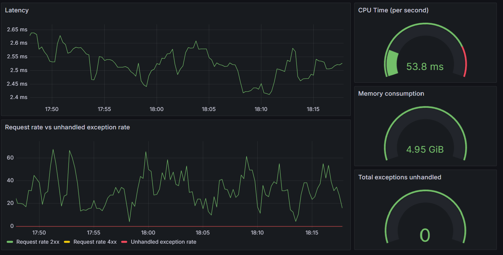

# Проект: рекомендация товаров в электронной коммерции

## Цель проекта 
Построение сервиса персонализированных рекомендаций для системы электронной коммерции. 

## Содержание

[Использованные технологии](#использованные-технологии)  
[Фаловая струкутра проекта](#фаловая-струкутра-проекта)  
[Подготовка виртуальной машины и развретывание инфраструктуры для обучения модели](#подготовка-виртуальной-машины-и-развретывание-инфраструктуры-для-обучения-модели)  
[Исследватальский анализ данных](#исследватальский-анализ-данных)  
[Проведение экспериментов и выбор алгоритмической архитектуры](#проведение-экспериментов-и-выбор-алгоритмической-архитектуры)  
[Продуктовый пайплан [пере]обучения модели](#продуктовый-пайплан-переобучения-модели)  
[Развертывание продуктового веб-сервиса и системы мониторинга](#развертывание-продуктового-веб-сервиса-и-системы-мониторинга)   
[Тестирование работы сервиса и симуляция нагрузки](#тестирование-работы-сервиса-и-симуляция-нагрузки)   
[Мониторинг](#мониторинг)


## Использованные технологии
- _EDA_: pandas, jupyter
- _Model research & build_: pandas, implicit (ALS), dvc
- _Service_: FastAPI, uvicorn, docker
- _Monitoring_: prometheus, grafana

## Фаловая струкутра проекта

```
.
├── data                          # Директория для исходных данных, должна содержать:
│   ├── category_tree.csv         # <-- данные по дереву категорий
│   ├── events.csv                # <-- данные по событиям
│   ├── item_properties_part1.csv # <-- каталог товаров, ч.1 
│   ├── item_properties_part2.csv # <-- каталог товаров, ч.2
│   └── ....
├── .env                          # <-- переменные окружения, создаётся на основе шаблона
├── .env_example                  # <-- шаблон для заполнения .env
├── ...
├── mlflow_server                 # Директория для скриптов mlflow
│   ├── mlflow_cleanup.sh         # <-- вспомогательный mlflow скрипт для очистки базы 
│   └── start_mlflow_server.sh    # <-- основной скрипт запуска mlflow для экспериментов
├── notebooks
│   ├── EDA.ipynb                 # <-- ноутбук с результатами обзорного анализа данных 
│   ├── experiments.ipynb         # <-- ноутбук с результатами экспериментов
│   ├── models
│   │   └── ...
│   └── utils -> ../utils
├── pics                          # картинки к README.md
│   ├── dashboard.png
│   └── redoc.png
├── prod_build                    # Директория dvc-пайплайна продуктовой сборки моделей
│   ├── build_date.yaml           # <-- целевая дата сборки (параметр)
│   ├── build.sh                  # <-- основной скрипт для запуска продуктовой сборки
│   ├── cache
│   │   └── ...
│   ├── dvc.lock
│   ├── dvc.yaml                  # <-- описание dvc пайплайна
│   ├── params.yaml               # <-- параметры сборки
│   ├── recs
│   │   ├── top_popular.parquet   # <-- результат сборки: топ-популярные
│   │   └── weighted_als.parquet  # <-- результат сборки: персональные ALS
│   └── steps
│       └── ...                   # <-- python скрипты для шагов пайплайна
├── pytest.ini
├── README.md
├── requirements.txt
├── service                       # Директория продуктового веб-сервиса и систем мониторинга
│   ├── app                       # Код fastapi микросервиса 
│   │   ├── core.py
│   │   └── service.py            # <-- основной файл приложения
│   ├── docker-compose.yaml       # <-- docker файл для запуска контейнеров
│   ├── Dockerfile_app            # <-- файл сборки образа приложения 
│   ├── prometheus                
│   │   └── prometheus.yml        # <-- конфигурация prometheus
│   ├── recs -> ../prod_build/recs     # <-- точка монтирования тома с моделями (внутри контейнера)
│   ├── requirements_service.txt  # <-- необходимые зависимости для сборки образа приложения
│   ├── start_local.sh
│   └── tests                     # Директория с тестами
│       ├── conftest.py
│       ├── load_simulation.py    # <-- Симуляция нагрузки на сервис
│       ├── test_data.json        # <-- данные для тестов
│       └── test_service.py       # <-- код юнит-тестов    
└── utils
    └── ...                       # <-- вспомогательные python скрипты для анализа/экспериментов
```

## Подготовка виртуальной машины и развретывание инфраструктуры для обучения модели

Склонируйте репозиторий проекта:

```
$ git clone https://github.com/AV31459/recsys_ecom.git
```

Перейдите в директорию проекта, создайте и активируйте виртуальное окружение, установите необходимые Python-пакеты из `requirements.txt`

```
$ cd recsys_ecom
$ python3 -m venv .venv
$ source .venv/bin/activate
$ pip install -r requirements.txt
```

Для развертывания инфраструктуры mlflow __необходимы доступы к внешней базе данных postgres и S3 хранилищу__.   
Параметры доступа должны быть указаты в файле `.env` в корневой директории проекта, для заполнения файла
 используйте шаблон `.env_example`.   

Файл с исходными данными для обучения моделей можно скачать по [ссылке](https://disk.yandex.ru/d/XPthmNk_pqEDaQ)  

__NB: Здесь и далее по тексту все команды выролняются из корневой директории проекта ❕__  

Перед первым запуском mlflow выполните команду:
```
$ chmod +x ./mlflow_server/start_mlflow_server.sh
```
Для запуска mlflow сервера выполните:
```
$ ./mlflow_server/start_mlflow_server.sh
```
По умолчанию сервер запускается по адресу `http://127.0.0.1:5000`


## Исследватальский анализ данных

Файл с резальтатами обзорного анализа данных `notebooks/EDA.ipynb`
Основные вывода по результатам исследовательского анализа данных:

__Дерево категорий__:

 - Дерево категорий товаров состоит из 1669 элементов относящихся к 25 категориям верхнего (первого) уровня. В среднем, каждая из категорий верхнего уровня содержит около ~50 подкатегорий.  

 - __Названия (описания) категорий в исходных данных отсутствуют, сделать какие либо выводы о природе продаваемых товаров (бытовая техника, книги, фильмы) не представляется возможным.__

__Каталог товаров__:
- Каталог содержит 417 тыс. уникальных товаров  

- Имеем 1104 уникальных названий свойств в столбце 'property'. За исключением двух строковых названий ('categoryid', 'available'), все остальные значения 'property' являются числовыми. Данных для расшифровки (декодированя) числовых значений 'property' у нас нет и, к тому же, значения 'values' для них также представлены в закодрованном виде - игнорируем (удалим) числовые 'properties' из каталога items.   

- Временные метки (timestamp) записей в таблице находятся в диапазоне от 2015-05-10 до 2015-09-13  

- __Все товары в каталоги имеют свойство (property) 'available', которое принимает значения 0 или 1__ - судя по названию, речь идёт о доступности товара. При этом, как видно из таблицы, в разные моменты времени свойство может иметь различные значения - __это, с большой долей вероятности, отражает историю доступности товара к покупке в различные моменты времени.__  

- Все товары в таблице имеют признк (categoryid) отнесения к какой-либо категории. Аналогично признаку доступности, признак категории (categoryid) может изменяеться с течением времени __[!] Интерпретируем следующим образом: примем, что товар относится к одной категории, с самой последней временной меткой (относительно времени расчета)__.   

- В кателоге товаров присутствуют 30 'дополнительных' категорий, которые отсутствуют в дереве категорий (табица category_tree). С этими 'дополнительными' категориями связано 137 товаров. Будем надеяться, что с данными товарами пользователи не взаимодействуют 😉 

- Из более 400 тыс. товаров на конец известного периода (2015-09-13) доступно к покупке около 54 тыс. (13%)

__События__:

- Таблица событий содержит данные о 2.7 млн. взаимодействий пользователей и товаров в период с 2015-05-03 по 2015-09-18  

- 97% от общего числа событий это просмотр товара, 70 тыс.(3%) - добавление в корзину, 22 тыс.(1%) - покупка. 

- Всего с сервисом взаимодействовало 1.4 млн. униакальных пользователей, при этом добавляли товар в корзину только 37 тыс. (3%), а совершили покупку 12 тыс. (1%)  

- Всего пользователи просмотрели 239 тыс. униакальных товаров, при этом добавили в коризину 23 тыс. уникальных товаров (~10% от просматриваемых), а купили 12 тыс. (~5% от просматриваемых).

- Поток событий (взаимодействий) пользователей с товарами распределен с мая по сентябрь достаточно равномерно, в среднем пользователи взаимодействуют (в основном посматривают) товары около 20 тыс. раз в день.   

- Значимые события (добавление в корзину, покупка) распределены по времени также достаточно равномерно (с учетом недельной сезонности), в среднем пользователи добавляют товар в корзину около 500 раз в день, совершают покупку около 160 раз в день.

- Еще раз обратим внимание, на низкую частотность значимых событий - __более 75% процентов пользователей, которые добавляли товар в корзину, сделали это только 1 (один) раз [!]__. 

- __В таблице событий присутствует около 50 тыс. 'неизвестных' товаров (отсутствующих в каталоге товаров items)__, что составляет около 20% от общего числа товаров, с которыми взаимодействовали пользователи.  
 При этом, суммарное число взаимодействий с 'неизвестными' товарами составляет только ~9% (255 тыс.) от общего числа событий. Таким образом, интерес (среднее кол-во взаимодействий) пользователей к 'неизвестным' товарам в среднем ниже, чем интерес к товарам, о которых есть информация в таблице items.

- Видим значитлеьное (~10%) число событий, для которых __в момент добавления в товара корзину сам товар был недоступен (availabilty = 0) или признак availability вообще отсутствовал (еще не был установлен)__. Для событий покупки товара ситуаия аналогичная.
Как следствие, __сделанное при анализе каталога товаров предположение о бизнес-значении признака (свойства) availabilty является ошибочным__ и требует уточнения. Использование признака availabilty его для построения модели (системы рекомендаций) представляется нецелессобразным. 

- __Для ~2% событий добавления товара в корзину, в момент совершения события в каталоге items еще отсутствовала запись о категории товара__ - другими словами, в этих случаях информация о категории товара (category_id) появляется в каталоге items позже, чем происходит само событие (добавление в корзину). 

__Типичный временной профиль взаимодействия пользователя с системой__

- Отфильтруем таблицу событий, оставив только 'эффективных' пользователей - тех, которые добавили товар в корзину.  

- Медианное число просмотров товара перед добавлением в корзину - 3 (три) просмотра. При этом видим 3 тыс. (~9% от целевых) полльзователей, для которых есть единственное(!) событие это добавление товара в корзину - т.е. они 'ничего не смотрят' - сразу добавляют товар.

- __❗ Типичный профиль взаимодействия 'эффективного' пользователя:__    
    - __пользоватетель приходит 'без истории'__ 
    - __просматривает несколько товаров (2-7)__ 
    - __добавляет один в корзину__
    - __как правило последний просмотренный__ 
    - __время на все про все порядка 10 минут__ 

## Проведение экспериментов и выбор алгоритмической архитектуры

Файл с результатами экспериментов и подробными выводами находится в `notebooks/experiments.ipynb`   
Основне шаги  и метрики залогированы в mlflow в эсперименте c именем  `Final_project`  
Основные выводы по результатам экспериментов:

__Разделение выборки__
- в качестве разделяющей даты выберем __1 сентября__ :)
- поскольку свойства товаров в каталоге items изменяются со временем, сформируем обучающий каталог товарв items_train - состояние каталога на момент обучения модели (на 1 сентября), оставим в таблице только последние по времени записи о признаках (категории) товаров.

__Метрики__

Для оценки качества оффлайн рекомендаций будем исопльзовать следующие метрики:
- _precision@5, recall@5_ - точность и полнота для среза топ-5 рекомендаций
- _coverage@50_ - покрытие по объектам для cреза топ-50 рекомендаций

__Подход к построению системы, методологичекие замечания__

Из общего кол-во пользователей, добавлявших товары в корзину в тестовый период (4275), только ~4% (191) делали это в обучающий период.  
__В связи с низкой частотностью целевых событий оффлайн-история целевых действий пользователй у нас, по сути, отсутствует.__  
Единственной дополнительной информацией для построения коллаборативынх оффлайн-моделей являеются _нецелевые_ события - просмотры товаров, которые имеются тоже для очень небольшого числа пользователей (около 12%, оценка по тестовой выборке)   

Исходя из изложенного, представляется разумным следующий архитектурный подход в виде объединения онлайн-рекомендаций на основе последних действий пользователя и предрассчитанных персональных оффлайн-рекомендаций (для ~12% пользователй с оффлайн-историей):
- онлайн рекомендации:
    - если данные об онлайн-взаимодействиях отсутсвуют (полностью холодный пользователь) - рекомендуем наиболее популярные товры (по всем категориям)
    - если есть данные о последних онлайн-взаимодействиях - рекомендуем наиболее популярные в просматриваемых категориях _плюс_ подмешиваем наиболее популярные по всем категориям
- оффлайн-рекомендации:
    - используем предварительно рассчитанные персональные рекомендации на основе имеющейся истории (при наличии)


__Эксперименты с различными оффлайн-моделями__

- _Топ популярных_: Неперсонализированные оффлайн-рекомендации топ-популярных товаров имеют ожидаемо невысокие метрики.

- _Naive ALS_: Для пользователей, имеющих оффлайн-историю, применнеие ALS с '_наивным_' добавлением к обучающим событиям _нецелевых_ событий просмотра товаров приводит к заметному увеличению метрик. 

- _Weighted ALS_ Взвешивание событий при построении матрицы взаимодействий приводит к заметному улучшению оффлайн-метрик (на 10% по метрикам precision/recall).

В связи с малой долей пользователей с оффлайн-историей и ограниченным временм на выполение проекта, дальнейшее улучшение качества персональных оффлайн рекомендаций (разработка дополнитлеьных кандидатов, построение ранжирующей модели и т.д.) представлеется излишней.

Итоговая таблица с оффлайн-метриками:

<div>
<table border="1" class="dataframe">
  <thead>
    <tr style="text-align: right;">
      <th></th>
      <th>precision_at_5_in_percent</th>
      <th>recall_at_5_in_percent</th>
      <th>coverage_at_50_in_percent</th>
    </tr>
  </thead>
  <tbody>
    <tr>
      <th>Top popular [all test users]</th>
      <td>0.41</td>
      <td>1.31</td>
      <td>0.01</td>
    </tr>
    <tr>
      <th>Top popular [test users with history]</th>
      <td>0.67</td>
      <td>1.27</td>
      <td>0.01</td>
    </tr>
    <tr>
      <th>Naive ALS [test users with history]</th>
      <td>1.23</td>
      <td>3.67</td>
      <td>0.68</td>
    </tr>
    <tr>
      <th>Weighted ALS [test users with history]</th>
      <td>1.40</td>
      <td>4.07</td>
      <td>1.07</td>
    </tr>
  </tbody>
</table>
</div>

__В качестве итоговых моделей для продуктивизации будем использовать _Топ популярных_ (для онлайн-рекомендаций, в т.ч. с учетом категории для персонифицированных онлайн) и _Weighted ALS_ для персонифицированных оффлайн.__


## Продуктовый пайплан [пере]обучения модели

Dvc-пайплан для продуктовой сборки находится в директории `prod_build/`   

- Исходные данные для расчетов оффлайн-рекомендаций (файлы *category_tree.csv, events.csv, item_properties_part_.csv*) должны находится в директории `data/`. Расположение файлов может быть дополнително настроено в параметрах пайплайна _prod_build/params.yaml_.   
- Дата (временная точка) для проведения расчета задается в файле _prod_build/build_date.yaml_, по умолчанию это _2015-09-01_. Все имеющиеся в исходных данных события _позднее_ указанной даты игнорируются.
- По результатм работы пайплана в диреткории `prod_build/recs/` формируются следующие файлы:
  - ***top_popular.parquet*** - таблица c топ-популярными товарами 
  - ***weighted_als.parquet*** - таблица с персональными рекомендациями для пользователей, имеющих историю взаимодействий
  - ***items_train.parquet*** - таблица с каталогом товаров на момент обучения моделей

Для запуска dvc-пайплайна обучения выполните команду:
```
$ chmod +x prod_build/build.sh  # один раз перед первым запуском
$ ./prod_build/build.sh
```
При необходимости запуск пайплайна можно инициализировать из airflow с помощью `@task.bash`, однако разворачивание инфраструктуры airflow  но на данном этапе представлется излишним.

__NB:__ Расчет персональных рекомендаций может занаять продолжительное время (в зависимости от мощности инфраструктуры).  


## Развертывание продуктового веб-сервиса и системы мониторинга

Для запуска продуктового веб-сервиса необходимо наличие в директории `prod_build/recs/` подготовленых (на предыдущем этапе) файлов с оффлайн рекомендациями и каталогом товаров: *top_popular.parquet, weighted_als.parquet, items_train.parquet*  

Для запуска сервиса введите команду:
```
$ docker compose -f service/docker-compose.yaml --env-file service/.env_service up --build
```

После сборки образов и загрузки файлов с данными (сообщение в логе: `INFO: recsys_service: <...>: RecSysHandler data loaded, ready to serve requests.`) сервис готов к работе.  

По умолчанию сервис запускается по адресу `http://127.0.0.1:7000`, настройки хоста/портов могут быть изменены в файле `.env_service`:
- HOST_EXTERNAL - внешний хост
- APP_PORT_EXTERNAL - внешний порт миросервиса
- PROMETHEUS_PORT_EXTERNAL - внешний порт prometheus
- GRAFANA_PORT_EXTERNAL - внешний порт grafana

Основной эндпойнт для получения рекомендаций `http://127.0.0.1:7000/recs`.

Документация к api сервиса и примеры запросов доступны на `http://127.0.0.1:7000/redoc` или `http://127.0.0.1:7000/docs`


## Тестирование работы сервиса и симуляция нагрузки

Для запуска тестов и провекрки расботоспособности сервиса выполните команду:
```
$ pytest
```
Файл с данными для unit тестов - значениями request/response находится в `service/tests/test_data.json`.  
По умолчанию в тестах проверяется совпадение кода ответа и длина списка полученных рекомендаций.

При необходимости дополнительной проверки точного совпадения рекомендаций с ожидаемыми значениями (сервис запущен с конкретными 'тестовыми' файлами оффлайн рекомендаций, для которых 'правильные' ответы рассчитаны и внесены по ключам _response_data_ в `test_data.json`), тесты могут быть запущены в 'строгом' режиме с ключом `--strict-mode`
```
$ pytest --strict-mode
```
   
Для запуска скрипта, симулирующего нагрузку на сервис, выполните команду:
```
$ python service/tests/load_simulation.py
```
Скрипт рабоотает по следующему алгоритму: в бесконечном цикле
  - генерируется случайное число корректных запросов к сервису в интервале [0, MAX_REQUEST_VOLLEY]
  - скрипт засыпает на случайное время в интервале [0, MAX_TIMEOUT]    

Значения констант MAX_REQUEST_VOLLEY, MAX_TIMEOUT заданы непосредственно в файле скрипта и, при необходимости, могут быть изменены.  

## Мониторинг

Для мониторинга работы сервиса могут быть использованы следующие метрики:

__Инрфраструткурные метрики__

Показывают потребление системных ресурсов:
  - Объем виртуальной памяти `process_virtual_memory_bytes{instance="recsys_app:7000"}`
  - Использование процессорного времени (в секунду) `rate(process_cpu_seconds_total[1m])`

__Прикладные метрики__

Показывают нагрузку на сервис, задержку (latency) и наличие внутренних ошибок при расчете рекомендаций:
- Частота входящих запросов (кол-во запросов в секунду) `rate(http_requests_total{handler="/recs"}[1m])`
- Среднее время ответа (latency) `increase(http_request_duration_seconds_sum{handler="/recs"}[1m]) / increase(http_request_duration_seconds_count{handler="/recs"}[1m])`
- Количество внутренних ошибок (unhandled exceptions) `app_recsys_handler_exception_counter_total` и их частота (кол-во ошибок в секунду) `rate(app_recsys_handler_exception_counter_total{}[1m])`

Общий вид оформленного дашборда:

